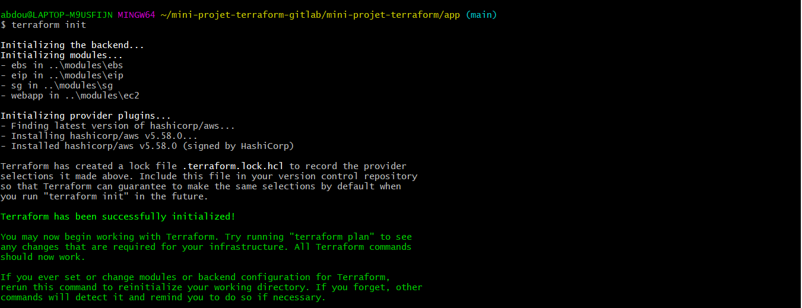

Prénom: Abdoul Gadirou

Nom: DIALLO

Promotion: BootCamp DevOps 17


# Provisionnement d'une instance AWS EC2 avec Terraform

  

 Le but de ce projet est de provionnée une instance ec2 Ubuntu Bionic auquel on va rattacher un groupe de sécurité, un volume EBS et une adresse IP public pour ensuite y installer un serveur _nginx_

 
**Livrable**


- Modules terraform (dossier app et modules)


# Structure des modules
  Pour provionner l'environnement j'ai écris 4 modules terraform et un module racine(_main_) dans le dossier _app_

   *1*-Module ec2 
   - Structure de notre module 

     

  - Dans le fichier main du module j'ai commencé par créer la _Datasource_  _aws_ami pour 
        récupérer dynamiquement la dernière version de l'AMI Ubuntu bionic
  - Ensuite je créer l’instance ec2 auquel je lie le groupe de sécurité (module sg).
  - Ensuite j'ai utilisé le provisionneur _remote-exec_ pour installer _nginx_ sur la 
        machine qui sera provisionnée
        
  - Variables déclarées et qui pourront être surchargées
    - *PUBLIC_KEY* : Variable contenant le chemin de la paire de clé de l'instance qui sera provisionnée 
    - *instancetype*: type de l'instance ec2
    - *ec2_common_tag* : tag de l'instance
    - *security_groups* : nom du groupe de sécurité qui sera lié à l'instance(voir module *sg*)
    - *ec2_instance_id*: variable de sortie permettant d'associer l'ec2 aux ebs et eip
   
  *2*-Module *ebs*

  Ce module permet de créer un volume ebs qui sera attacher à l'ec2

  - Variables déclarées et qui pourront être surchargées:
    - *availability_zone* zone de disponibilité du volume ebs qui doit être la même que la 
          zone de disponibilité de l'ec2
    - *size*: taille du volume ebs 
    - *ebs_tag*: tag du volume ebs

  *3*- Module *eip*

  Ce module permet de créer une adresse ip public qui sera lié à l'ec2
  - Variables déclarées et qui pourront être surchargées:
    - *aws_eip_id*: variable de sortie qui permettra d'associer l'ip publique à l'instance ec2

  *4* - Module *sg*

  Ce module permet de créer un groupe de sécurité pour l'ec2 en ouvrant les ports ssh (22),http (80) et https (443)
  - Variables déclarées et qui pourront être surchargées:
     - *mini_projet_sg*:Variable de sortie qui permettra d'associer le groupe de sécurité à l'instance ec2
     - *mini_projet_abdoul_sg*:variable correspondant au tag du groupe de sécurité


*5*- *Main* :
  
   Dans le fichier main.tf du module racine *app* j’appelle les 4 modules (ec2,sg,eip,ebs) pour déployer l’ec2 et pour rendre le déploiement dynamique j’ai surchargé les variables.
   Le dossier *app* contient egalement le fichier d'etat de l'infrastructure (_terraform.tfstate_)
      J’ai également rajouté deux ressources :
    
  - *aws_volume_attachment*: ressource permettant d’attacher le volume _ebs_ à l’instance
  - *aws_eip_association* :ressource permettant d’associer l’ip public à l’instance.

# Démarrage et configuration 
  ## Prérequis

  - Installer la version 1.7.3 de terraform sur la machine local
  - Crée une paire de clé nommé _devops-abdoul_ dans AWS
   - Configurée les accès AWS sur le poste (voir configuration des accès AWS)

  ## Configuration des accès AWS
  - Sur linux 
       
       ```
       export AWS_ACCESS_KEY_ID="PUT_YOUR_OWN"
       export AWS_SECRET_ACCESS_KEY="PUT_YOUR_OWN"

       ```
  - Sur windows avec Powershell

       ```
       $Env:AWS_ACCESS_KEY_ID="PUT_YOUR_OWN"
       $Env:AWS_SECRET_ACCESS_KEY="PUT_YOUR_OWN"
       ```
   ## Provisionnement dans AWS avec terraform
  - Cloner le projet  
     ```
     git clone https://github.com/abdel-dialo/mini-projet-terraform.git
     ```


  - Aller dans le repertoire _app_
    
    ```
    cd app
    
    ```
  
  - Provisionner les ressources en tapant les commandes suivantes :

       ```
       terraform init
       
       ```
       

       ```
        terraform plan
       ```
       
       ```
       terraform apply
       ```
       

       

       

       

       

  - Détruire les ressources en tapant la commande suivante:
      
      ```
      terraform init
      ```
      

